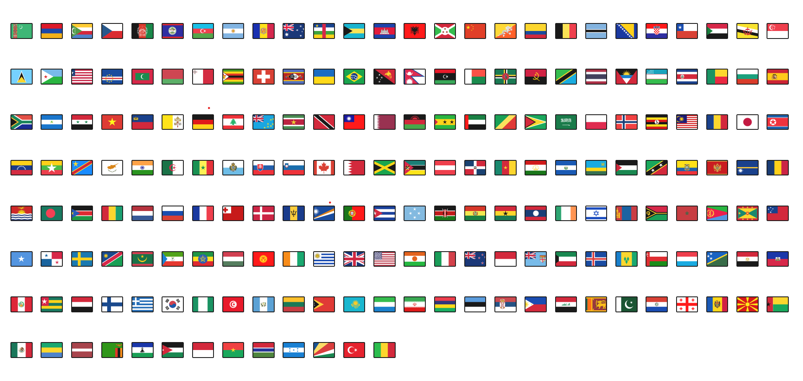
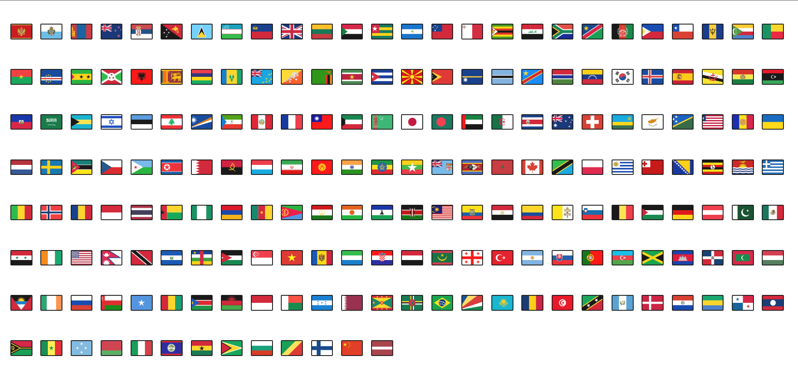

Overview

This React project dynamically displays world flags using the react-world-flags package. It shuffles a predefined list of country codes and renders the corresponding flags.

Features

Displays flags for various countries

Uses React state and useEffect for dynamic updates

Randomizes flag order each time the component mounts

Styled using CSS for better layout

Installation

To run this project, follow these steps:

Clone the repository:

sh

<!-- git clone https://github.com/your-repo/flags-display.git -->
Navigate into the project directory:

sh

cd flags-display
Install dependencies:

sh

npm install
Start the development server:

sh
npm start

Usage

This project uses the react-world-flags package to render country flags dynamically. Flags are shuffled upon component mount, ensuring a random order each time.

Dependencies

React
react-world-flags

Screenshot

